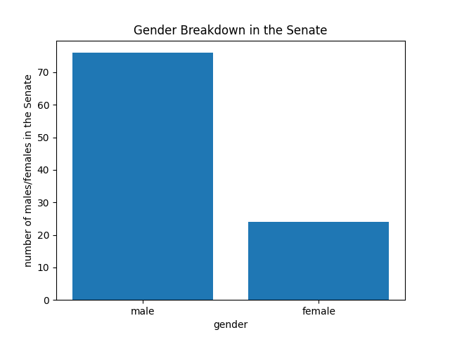
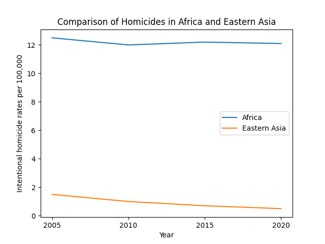

# Project 2
 Project 2 for CSCI040
## Gender Breakdown of the Members of the Senate

#### This graph looks at the gender breakdown of Senate. It allows us to compare how many males and females make up the Senate and see if there is a gender with more influence. We can see that there are over 3 times as many males as there are females. This data was found on [this repository](https://github.com/jdorfman/awesome-json-datasets) and that brought me to [this website](https://www.govtrack.us/api/v2/role?current=true&role_type=senator).

## Intentional Homicides in Africa and Eastern Asia

#### This graph looks at Africa and Eastern Asia and their homicide rates per 100,000. As we can see from the graph, Africa has much higher rates than Eastern Asia. We look at the years 2005, 2010, 2015, and 2020 and see how the rate changed over the years. This data was found on [this website](http://data.un.org/) and it brought me to [this dataset](http://data.un.org/_Docs/SYB/PDFs/SYB65_328_202209_Intentional%20homicides%20and%20other%20crimes.pdf).

[Project Instructions](https://github.com/mikeizbicki/cmc-csci040/tree/2022fall/project_02)